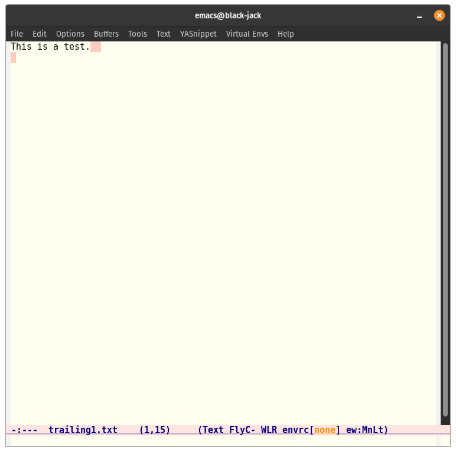

ethan-wspace: a non-intrusive emacs configuration for handling whitespace
=========================================================================

The problem: spurious git diffs when whitespace changes happen.

When text and code does not have a canonical form, it's possible for
someone to change from one form to another without intending to or
noticing. As an example, someone can add or remove whitespace "after"
the text on the end of a line without changing its meaning.

A common solution to this is to automatically "clean" whitespace on
every save. But this can introduce its own spurious diffs when working
on a file that isn't already clean.

The solution: ``ethan-wspace``.

How it works
============

When ``ethan-wspace`` is activated in a buffer, it examines the
whitespace in that buffer and does different things depending on
whether that whitespace is clean or dirty.

- If the whitespace is dirty, then ``ethan-wspace`` will highlight the
  "errors", so you can be cognizant of where the whitespace is already
  dirty. This can help you preserve the whitespace as-is, although it
  does not prevent you from introducing new errors.

- If the whitespace is already clean, then ``ethan-wspace`` will
  insert hooks to clean this whitespace on save. This will ensure that
  the whitespace remains clean, even if you introduce errors
  yourself. Because the whitespace will be automatically cleaned,
  there is no need to display whitespace specially, and no
  highlighting is added.

It looks like this:

What am I looking at
====================

When you open files (N.B. but not non-file buffers), bad whitespace
will be highlit and clean whitespace will be maintained by cleaning
just before files are saved. There's also a mode line "lighter" for
``ethan-wspace`` which looks something like ``ew:mnLt``. Each letter
corresponds to a kind of whitespace (see "Errors", below). Lower case
letters indicate categories of whitespace which will be cleaned before
save; upper case letters indicate categories which are being
highlit.

You can switch from one to the other using ``M-x
ethan-wspace-highlight-FOO-mode`` or ``M-x
ethan-wspace-clean-FOO-mode`` (each mode disables the other). You can
also click on the corresponding letter in the modeline lighter, which
will switch from cleaning to highlighting or back.

If you want to clean all kinds of whitespace, you can use ``M-x
ethan-wspace-clean-all``, which immediately cleans everything and
switches to clean-before-save on all whitespace types.

Errors
======

ethan-wspace recognizes the following categories of whitespace errors:

1. trailing whitespace at end of line (``eol``, modeline letter ``L`` for "end of Line").

2. no trailing newline (``no-nl-eof``, modeline letter ``N`` for "No trailing newline").

3. more than one trailing newline (``many-nls-eof``, modeline letter ``M`` for "Many trailing newlines").

4. tabs, at all (``tabs``, modeline letter ``T``).

It recognizes these categories independently, and treats each category
as clean or not-clean.

eol
---

If you are editing some line, and are writing something at the end of
it, and have added some spaces, but your cursor is just after those
spaces, the spaces aren't considered "trailing" yet. They won't be
highlit if you are in ``highlight-eol-mode``. If you are in
``clean-eol-mode``, and you should save the buffer, the spaces will be
cleaned, the buffer will be saved, and the spaces will be re-added for
your convenience\ [1]_. Similar behavior exists for
newlines-at-end-of-file.

.. [1] This may have the surprising behavior that your file appears
       "clean" even though its contents are not exactly what is on
       disk.

tabs
----

Some file formats (notably Makefiles) treat tabs as syntactically
significant. Tabs in these files are not errors but are actually
required. To try to accommodate these files, ``ethan-wspace`` will
check the value of the variable ``indent-tabs-mode``. If set, tabs
will not be considered errors (so they will neither be highlit nor
converted to spaces on saves). However, this means you are on your
own if some lines happen to indent using spaces.

You can override this behavior (if you desire) by customizing
``ethan-wspace-errors-in-buffer-hook``, using something like::

    (defun i-still-really-hate-tabs ()
      (if (not (member 'tabs ethan-wspace-errors))
         (setq ethan-wspace-errors (cons 'tabs ethan-wspace-errors))))
    (add-hook 'ethan-wspace-errors-in-buffer-hook 'i-still-really-hate-tabs)

Installation
============

You should also remove any customizations you have made to turn on
either ``show-trailing-whitespace`` or ``require-final-newline``; we
handle those for you. (But note that ``require-final-newline`` is
turned on by some modes based on the value of
``mode-require-final-newline``, so you may have to turn that off.)

::

   (custom-set-variable
     '(mode-require-final-newline nil))

``ethan-wspace`` is in MELPA and can be installed using
``package-install``. If you use ``use-package``, a sample config might be::

  (use-package ethan-wspace
    :ensure t
    :config
    (setq mode-require-final-newline nil)
    (global-ethan-wspace-mode 1))

Otherwise, you can manually add the ``lisp`` directory to your
``load-path``, and then ``(require 'ethan-wspace)``. In other words,
add to your ``init.el`` something like the following::

    (add-to-list 'load-path (expand-file-name "~/.emacs.d/upstream/ethan-wspace.git/lisp"))
    (require 'ethan-wspace)
    (global-ethan-wspace-mode 1)

You might also want to customize the face used to highlight erroneous
whitespace. This is configurable by ``ethan-wspace-face``. A default
face is computed based on the background of your frame when
``ethan-wspace`` was ``require``\ d (so you might want to make your
calls to ``color-theme`` first).

Relationship to other emacs things
==================================

Most other emacs whitespace customizations (and there are many: see
`ShowWhiteSpace on the EmacsWiki
<http://www.emacswiki.org/emacs/ShowWhiteSpace>`_) focus on showing
problematic whitespace. There are also some customizations out there
focused on `Deleting Whitespace
<http://www.emacswiki.org/emacs/DeletingWhitespace>`_. But there are
many and they all have extremely similar names. (``ethan-wspace`` aims
to be the most egotistically-named package.) ``ethan-wspace`` subsumes most of them, except for ``whitespace.el`` to show all whitespace in non-programming contexts, and ``ws-trim.el`` which I had never heard of before just now.

* `whitespace.el <http://www.emacswiki.org/emacs/WhiteSpace>`_ and the
  family of related code that includes ``visws.el``,
  ``whitespace-mode.el``, ``show-whitespace-mode.el``, and
  ``blank-mode.el`` has many options for making whitespace characters
  visible, both by faces and by changing their representations in the
  display table. That seems very useful for editing binary files or
  other circumstances where you care exactly what whitespace you're
  looking at, but it isn't really useful for editing source code,
  where you typically want whitespace to be as clean as possible. I
  have no idea which of those files is most recent or "best", as I
  have never used them.

* `ws-trim.el <ftp://ftp.lysator.liu.se/pub/emacs/ws-trim.el>`_
  automatically trims whitespace on edited lines. With a low
  ``ws-trim-level`` it is complementary to ``ethan-wspace``, and may
  be useful to encourage you to delete whitespace organically. I'd
  never heard about this package and hopefully ``ethan-wspace`` will
  grow similar functionality soon.

* `ws-butler <https://github.com/lewang/ws-butler>`_ automatically
  trims whitespace on edited lines too, like an improved ws-trim.

* Putting ``delete-trailing-whitespace`` or
  ``nuke-trailing-whitespace`` in your ``before-save-hook`` is now
  obsolete; these functions are too aggressive and will cause you many
  spurious whitespace commits.

* Standard emacs variables ``show-trailing-whitespace`` and
  ``require-final-newline`` are "subsumed" by this mode --
  ``require-final-newline`` is reimplemented in a more general way,
  and ``show-trailing-whitespace`` is triggered per-buffer by this
  mode. (``show-trailing-whitespace`` is built into emacs core and
  seems to be the fastest/most elegant way to highlight trailing whitespace.)

* ``next-line-add-newlines``, to add newlines when you move forward
  lines, still exists and is unchanged. I recommend you set this to
  nil (if it isn't already -- I think it is nil in all versions since
  21.1), but ``ethan-wspace`` will still trim unnecessary newlines on each
  save if there were fewer than two when the buffer was opened.

* `redspace.el <http://www.emacswiki.org/emacs/redspace.el>`_ is a
  small library meant only to highlight trailing whitespace. This is
  already done by the variable ``show-trailing-whitespace``, which is
  used internally by ``ethan-wspace``. ``show-trailing-whitespace``
  has the nice effect that it doesn't highlight trailing whitespace
  when your cursor is after it -- so you don't see little blinking
  lights as you type a line of text.

* `show-wspace.el <http://www.emacswiki.org/emacs/show-wspace.el>`_ is
  a library that has lots of faces to show tabs, trailing whitespace,
  and "hard spaces". ``ethan-wspace`` obsoletes this mode too.

FAQ
===

Who cares?
----------

Honestly, you're right. I sincerely doubt using these customizations
will make your life as a programmer even 1% more productive. 1% is
nothing. You'd do better to buy a bigger monitor.

I just hate spurious git diffs so much. And when I was working on a
codebase with dirty files, I couldn't just clean everything without
making my subsequent PRs dirty too. If I accidentally cleaned
something, I'd have to carefully undo the cleaning so my commits
didn't include it. A nightmare! ``ethan-wspace`` is the result.

Who died and made you absolute ruler of whitespace?
---------------------------------------------------

Listen. You may have some opinions about whitespace in your source
code. They may even amount to preferences. However, it takes a
seriously twisted person to think about whitespace obsessively. I
have.

The fact is that I simply have more opinions about whitespace than you
do. That makes mine more correct.

My tabs! Get your hands off my tabs!
------------------------------------

It is my opinion (and remember, my opinions are right) that you should
never, ever have tabs in your source code, at all. If you disagree,
please see `Tabs Are Evil
<http://www.emacswiki.org/emacs/TabsAreEvil>`_ on the EmacsWiki. This
was once a holy war, and then for a time it was settled, but these
days, the idea that tabs are acceptable is making a resurgence due to
`gofmt <https://golang.org/cmd/gofmt/>`_.

Perhaps you are one of those bizarre creatures who uses `Smart Tabs
<http://www.emacswiki.org/emacs/SmartTabs>`_. In that case, you are
even more OCD about whitespace than I am, and in a twisted way I
salute you. However, ``ethan-wspace`` by default treats tabs as
errors, which you might find distracting. In that case, I recommend
something like the following::

    (set-default 'ethan-wspace-errors (remove 'tabs ethan-wspace-errors))

We don't have an error type yet for smart tabs, but patches to add one
would be welcome.

More ranting about Tabs Are Evil
--------------------------------

Required reading for this discussion is JWZ's "famous" `tabs versus
spaces <http://www.jwz.org/doc/tabs-vs-spaces.html>`_ post. He
sets out three categories of effect that tabs have, and how to defuse
the whole situation.

I have encountered people who prefer tabs because they prefer being
able to press backspace and go exactly one level of indentation
back. These people are obviously wrong because if you're using a
halfway decent editor, it should be capable of indenting CORRECTLY for
you automatically (i.e. emacs's ``TAB`` behavior), as well as
backspacing a whole level in languages where that's useful
(i.e. emacs's ``python-backspace``). So this argument just boils down
to "I have a crappy text editor."

You may encounter people who say things like, "Tabs are better because
they let everybody set their own indentation width." And this is true
to a point. If you are one of those people, pop quiz: let's say you
use tabs, and prefer them to be four spaces wide. How do you indent
the last line of this code?

::

    if __name__ == '__main__':
        main.Application(config, sys.argv, time.time(),
                         docutils.parsers.rst.directives.images.Image)

If you said "five tabs, one space" -- you lose. Because then when you move to Jean's machine, where tabs are two spaces, you find::

    if __name__ == '__main__':
        main.Application(config, sys.argv, time.time(),
               docutils.parsers.rst.directives.images.Image)

And on Johann's machine, where tabs are eight spaces, you see::

    if __name__ == '__main__':
        main.Application(config, sys.argv, time.time(),
                                   docutils.parsers.rst.directives.images.Image)

Your beautifully-indented source code has been scattered to the
winds. You've just demonstrated that you aren't crazy enough to think
about whitespace issues obsessively enough. Rejoice! There is a place
for you in normal society.

It's due to code above that truly demented people will suggest using
tabs for *blocks only* and *spaces within blocks*. This is the "Smart
Tabs" approach mentioned above. In the above code, that gives you "one
tab, seventeen spaces". I've never seen a project with this as the
coding standard, and I'll never suggest it for a real project, for the
simple fact that people are lazy and source-code editors are
imperfect, and somewhere, somehow, I am certain to come across spaces
where there should be tabs, or tabs where there should be spaces. And
then I will be furious.

Rather than try to ensure complete compliance with this extremely
complicated rule for source code formatting, I have set my sights on
the simpler expedient of just outlawing tabs in source code entirely
and consigning them to the dustbin of history.

Licensing
=========

``ethan-wspace`` is released under a BSD license (see ``COPYING``).
